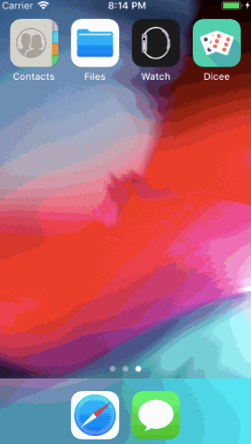
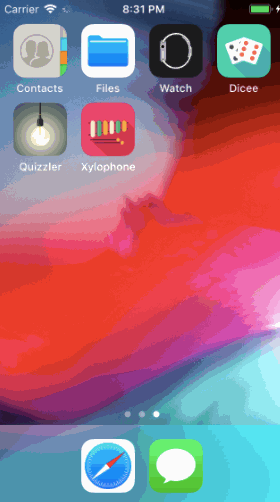
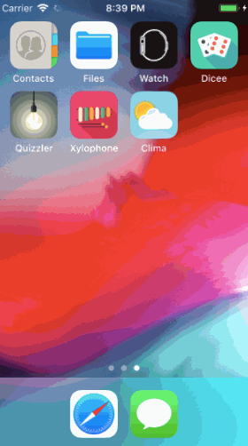

# iOS-development

I spent a weekend to take an Udemy course: iOS 12 & Swift - The Complete iOS App Development Bootcamp, and made several basic apps. https://www.udemy.com/ios-12-app-development-bootcamp

